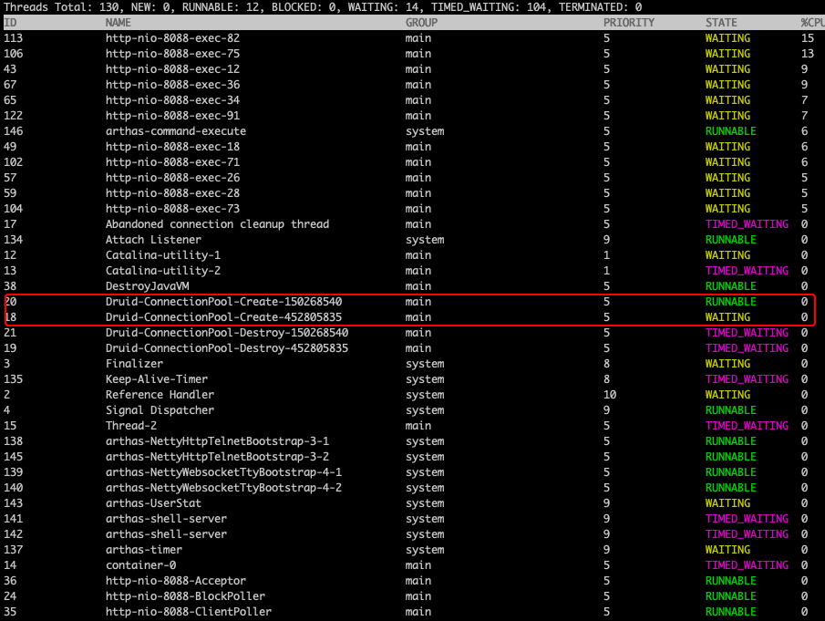
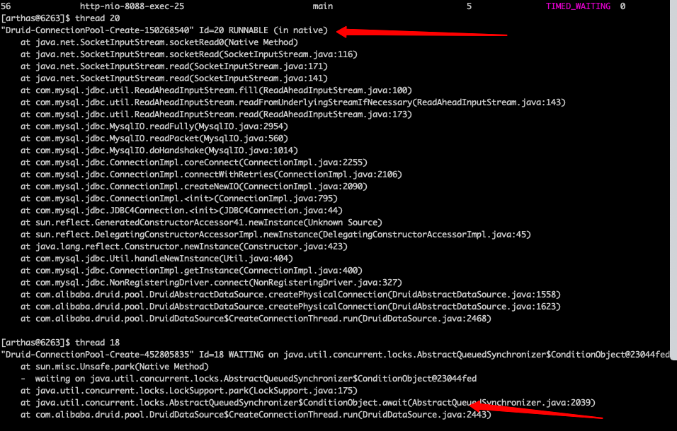

## 问题描述
**应用底层通过druid连接mysql数据库，故障时mysql进程异常，值班运维执行了mysql进程重启，网卡reset
等操作，发现应用方8台机器，只有一半恢复了正常,另外的机器需要重启应用才能恢复正常**  
正常的机器在恢复前报错如下：
```
... 101 more\nCaused by: com.alibaba.druid.pool.GetConnectionTimeoutException: wait millis 3000, active 1, maxActive 100, creating 1
	at com.alibaba.druid.pool.DruidDataSource.getConnectionInternal(DruidDataSource.java:1510)
	at com.alibaba.druid.pool.DruidDataSource.getConnectionDirect(DruidDataSource.java:1255)
	at com.alibaba.druid.pool.DruidDataSource.getConnection(DruidDataSource.java:1235)
	at com.alibaba.druid.pool.DruidDataSource.getConnection(DruidDataSource.java:1225)
	at com.ly.dal.manager.TransactionContextManager.doGetRealConnection(TransactionContextManager.java:319)
	... 107 more\nCaused by: com.mysql.jdbc.exceptions.jdbc4.MySQLNonTransientConnectionException: Could not create connection to database server. Attempted reconnect 3 times. Giving up.
	at sun.reflect.NativeConstructorAccessorImpl.newInstance0(Native Method)
	at sun.reflect.NativeConstructorAccessorImpl.newInstance(NativeConstructorAccessorImpl.java:62)
	at sun.reflect.DelegatingConstructorAccessorImpl.newInstance(DelegatingConstructorAccessorImpl.java:45)
	at java.lang.reflect.Constructor.newInstance(Constructor.java:423)
	at com.mysql.jdbc.Util.handleNewInstance(Util.java:404)
	at com.mysql.jdbc.Util.getInstance(Util.java:387)
	at com.mysql.jdbc.SQLError.createSQLException(SQLError.java:917)
	at com.mysql.jdbc.SQLError.createSQLException(SQLError.java:896)
	at com.mysql.jdbc.SQLError.createSQLException(SQLError.java:885)
	at com.mysql.jdbc.SQLError.createSQLException(SQLError.java:860)
	at com.mysql.jdbc.ConnectionImpl.connectWithRetries(ConnectionImpl.java:2165)
	at com.mysql.jdbc.ConnectionImpl.createNewIO(ConnectionImpl.java:2090)
	at com.mysql.jdbc.ConnectionImpl.<init>(ConnectionImpl.java:795)
	at com.mysql.jdbc.JDBC4Connection.<init>(JDBC4Connection.java:44)
	at sun.reflect.GeneratedConstructorAccessor84.newInstance(Unknown Source)
	at sun.reflect.DelegatingConstructorAccessorImpl.newInstance(DelegatingConstructorAccessorImpl.java:45)
	at java.lang.reflect.Constructor.newInstance(Constructor.java:423)
	at com.mysql.jdbc.Util.handleNewInstance(Util.java:404)
	at com.mysql.jdbc.ConnectionImpl.getInstance(ConnectionImpl.java:400)
	at com.mysql.jdbc.NonRegisteringDriver.connect(NonRegisteringDriver.java:327)
	at com.alibaba.druid.pool.DruidAbstractDataSource.createPhysicalConnection(DruidAbstractDataSource.java:1558)
	at com.alibaba.druid.pool.DruidAbstractDataSource.createPhysicalConnection(DruidAbstractDataSource.java:1623)
	at com.alibaba.druid.pool.DruidDataSource$CreateConnectionThread.run(DruidDataSource.java:2468)\nCaused by: com.mysql.jdbc.exceptions.jdbc4.CommunicationsException: Communications link failure
The last packet sent successfully to the server was 0 milliseconds ago. The driver has not received any packets from the server.
	at sun.reflect.GeneratedConstructorAccessor115.newInstance(Unknown Source)
	at sun.reflect.DelegatingConstructorAccessorImpl.newInstance(DelegatingConstructorAccessorImpl.java:45)
	at java.lang.reflect.Constructor.newInstance(Constructor.java:423)
	at com.mysql.jdbc.Util.handleNewInstance(Util.java:404)
	at com.mysql.jdbc.SQLError.createCommunicationsException(SQLError.java:981)
	at com.mysql.jdbc.MysqlIO.readPacket(MysqlIO.java:628)
	at com.mysql.jdbc.MysqlIO.doHandshake(MysqlIO.java:1014)
	at com.mysql.jdbc.ConnectionImpl.coreConnect(ConnectionImpl.java:2255)
	at com.mysql.jdbc.ConnectionImpl.connectWithRetries(ConnectionImpl.java:2106)
	... 12 more\nCaused by: java.io.EOFException: Can not read response from server. Expected to read 4 bytes, read 0 bytes before connection was unexpectedly lost.
	at com.mysql.jdbc.MysqlIO.readFully(MysqlIO.java:2957)
	at com.mysql.jdbc.MysqlIO.readPacket(MysqlIO.java:560)
	... 15 more
```
异常的机器一直报错如下：
```
Caused by: com.alibaba.druid.pool.GetConnectionTimeoutException: wait millis 3000, active 1, maxActive 100, creating 1
at com.alibaba.druid.pool.DruidDataSource.getConnectionInternal(DruidDataSource.java:1512)
at com.alibaba.druid.pool.DruidDataSource.getConnectionDirect(DruidDataSource.java:1255)
at com.alibaba.druid.pool.DruidDataSource.getConnection(DruidDataSource.java:1235)
at com.alibaba.druid.pool.DruidDataSource.getConnection(DruidDataSource.java:1225)
at com.ly.dal.manager.TransactionContextManager.doGetRealConnection(TransactionContextManager.java:319)
... 101 more
```

区别就在于：**故障机器一直没有socket的异常，无论是连接失败还是连接reset，都会抛出异常，而故障机器确没有。**
由于业务方直接将应用重启了，没有现场，于是上网搜了一下有没有别人碰到这种错误，找到一篇类似的[博客](https://www.jianshu.com/p/3c85c9ddffd3)  。  
##问题复现
正常应用服务器通过druid连接mysql，复现场景如下：  
1.断网。断开应用和mysql的联网，然后过一段时间重新连接，可以连上  
2.重启mysql进程。  
3.mysql机器网卡重启。  

以上三种方法都无法将问题复现。  
此时只能寄出大杀器阿里的混沌工具[chaosBlade](https://github.com/chaosblade-io/chaosblade)  。  
chaosBlade可以模拟断网操作，丢包率，网卡包损坏等，具体的[教程在此](https://chaosblade-io.gitbook.io/chaosblade-help-zh-cn/blade-create-network-corrupt)  。  
我当时试了好多方法，终于在丢包率设置90%的时候，将错误复现了，我们把丢包率恢复正常后，应用并不能恢复正常。
```
blade create network loss --percent 90 --interface eth0 --remote-port 3022
```
由于我是在应用法机器上做的混沌实验，所以这里设置的是远程端口的丢包率，3022就是我mysql的机器的端口。  
然后我们在用[阿尔萨斯](https://github.com/alibaba/arthas/blob/master/README_CN.md)  看一下具体的线程状态.  

可以看到有两个Druid-ConnectionPool-Create 的线程，因为我们有两个db需要连接，所以有两个druid连接池，因此有两个创建连接的线程。  

看一下两个线程的线程栈信息：


第一个线程是有问题的线程，所以卡在了socket的read上，相当于线程假死。这时候就算收到信号，由于卡在了read上，也无法创建连接了。

第二个线程是正常的线程，一直在wait直到有信号将他唤醒来创建连接。

##源码分析

```
public class CreateConnectionThread extends Thread {

        public CreateConnectionThread(String name){
            super(name);
            this.setDaemon(true);
        }

        public void run() {
            initedLatch.countDown();

            long lastDiscardCount = 0;
            int errorCount = 0;
            for (;;) {
                // addLast
                try {
                    lock.lockInterruptibly();
                } catch (InterruptedException e2) {
                    break;
                }

                long discardCount = DruidDataSource.this.discardCount;
                boolean discardChanged = discardCount - lastDiscardCount > 0;
                lastDiscardCount = discardCount;

                try {
                    boolean emptyWait = true;

                    if (createError != null
                            && poolingCount == 0
                            && !discardChanged) {
                        emptyWait = false;
                    }

                    if (emptyWait
                            && asyncInit && createCount < initialSize) {
                        emptyWait = false;
                    }

                    if (emptyWait) {
                        // 必须存在线程等待，才创建连接
                        if (poolingCount >= notEmptyWaitThreadCount //
                                && !(keepAlive && activeCount + poolingCount < minIdle)) {
                            empty.await();
                        }

                        // 防止创建超过maxActive数量的连接
                        if (activeCount + poolingCount >= maxActive) {
                            empty.await();
                            continue;
                        }
                    }

                } catch (InterruptedException e) {
                    lastCreateError = e;
                    lastErrorTimeMillis = System.currentTimeMillis();

                    if (!closing) {
                        LOG.error("create connection Thread Interrupted, url: " + jdbcUrl, e);
                    }
                    break;
                } finally {
                    lock.unlock();
                }

                PhysicalConnectionInfo connection = null;

                try {
                    connection = createPhysicalConnection();
                    setFailContinuous(false);
                } catch (SQLException e) {
                    LOG.error("create connection SQLException, url: " + jdbcUrl + ", errorCode " + e.getErrorCode()
                              + ", state " + e.getSQLState(), e);

                    errorCount++;
                    if (errorCount > connectionErrorRetryAttempts && timeBetweenConnectErrorMillis > 0) {
                        // fail over retry attempts
                        setFailContinuous(true);
                        if (failFast) {
                            lock.lock();
                            try {
                                notEmpty.signalAll();
                            } finally {
                                lock.unlock();
                            }
                        }

                        if (breakAfterAcquireFailure) {
                            break;
                        }

                        try {
                            Thread.sleep(timeBetweenConnectErrorMillis);
                        } catch (InterruptedException interruptEx) {
                            break;
                        }
                    }
                } catch (RuntimeException e) {
                    LOG.error("create connection RuntimeException", e);
                    setFailContinuous(true);
                    continue;
                } catch (Error e) {
                    LOG.error("create connection Error", e);
                    setFailContinuous(true);
                    break;
                }

                if (connection == null) {
                    continue;
                }

                boolean result = put(connection);
                if (!result) {
                    JdbcUtils.close(connection.getPhysicalConnection());
                    LOG.info("put physical connection to pool failed.");
                }

                errorCount = 0; // reset errorCount
            }
        }
    }
```
CreateConnectionThread的源码可以看到，为了避免在创建连接的时候开启新的线程/线程池,这里是用了一个死循环在做这个事。如果有信号将其唤醒，那么就会去创建新的线程。创建完之后就进入下一个循环，即等待新的信号将其唤醒创建连接。  
我们的程序必须重启才可以解决问题，是因为CreateConnectionThread卡在了创建连接的这一步，可以从问题复现看到socket.read这一步看到我们的程序一直卡在这里了。所以问题就是我们在创建连接的时候没有设置超时时间吗？答案确实是没有设置。  
其实druid的报错信息已经能看到我们创建连接的url是这个：
```
jdbc:mysql://xx.xx.xx.xx:3027/xx?useUnicode=true&characterEncoding=utf8&autoReconnect=true
```
##解决方案
在设置druid连接池的时候设置一下**connectTimeout,socketTimeout**。


* Sidebar


* Sidebar (Post details page)


* Mobile


## Installation

Check whether you have `Ruby 2.1.0` or higher installed:

```sh
ruby --version
```

Install `Bundler`:

```sh
gem install bundler
```

Clone Jacman theme:

```sh
git clone https://github.com/Simpleyyt/jekyll-theme-next.git
cd jekyll-theme-next
```

Install Jekyll and other dependencies from the GitHub Pages gem:

```sh
bundle install
```

Run your Jekyll site locally:

```sh
bundle exec jekyll server
```

More Details：[Setting up your GitHub Pages site locally with Jekyll](https://help.github.com/articles/setting-up-your-github-pages-site-locally-with-jekyll/)


## Features

### Multiple languages support, including: English / Russian / French / German / Simplified Chinese / Traditional Chinese.

Default language is English.

```yml
language: en
# language: zh-Hans
# language: fr-FR
# language: zh-hk
# language: zh-tw
# language: ru
# language: de
```

Set `language` field as following in site `_config.yml` to change to Chinese.

```yml
language: zh-Hans
```

### Comment support.

NexT has native support for `DuoShuo` and `Disqus` comment systems.

Add the following snippets to your `_config.yml`:

```yml
duoshuo:
  enable: true
  shortname: your-duoshuo-shortname
```

OR

```yml
disqus_shortname: your-disqus-shortname
```

### Social Media

NexT can automatically add links to your Social Media accounts:

```yml
social:
  GitHub: your-github-url
  Twitter: your-twitter-url
  Weibo: your-weibo-url
  DouBan: your-douban-url
  ZhiHu: your-zhihu-url
```

### Feed link.

> Show a feed link.

Set `rss` field in theme's `_config.yml`, as the following value:

1. `rss: false` will totally disable feed link.
2. `rss:  ` use sites' feed link. This is the default option.

    Follow the installation instruction in the plugin's README. After the configuration is done for this plugin, the feed link is ready too.

3. `rss: http://your-feed-url` set specific feed link.

### Up to 5 code highlight themes built-in.

NexT uses [Tomorrow Theme](https://github.com/chriskempson/tomorrow-theme) with 5 themes for you to choose from.
Next use `normal` by default. Have a preview about `normal` and `night`:


Head over to [Tomorrow Theme](https://github.com/chriskempson/tomorrow-theme) for more details.

## Configuration

NexT comes with few configurations.

```yml

# Menu configuration.
menu:
  home: /
  archives: /archives

# Favicon
favicon: /favicon.ico

# Avatar (put the image into next/source/images/)
# can be any image format supported by web browsers (JPEG,PNG,GIF,SVG,..)
avatar: /default_avatar.png

# Code highlight theme
# available: normal | night | night eighties | night blue | night bright
highlight_theme: normal

# Fancybox for image gallery
fancybox: true

# Specify the date when the site was setup
since: 2013

```

## Browser support


